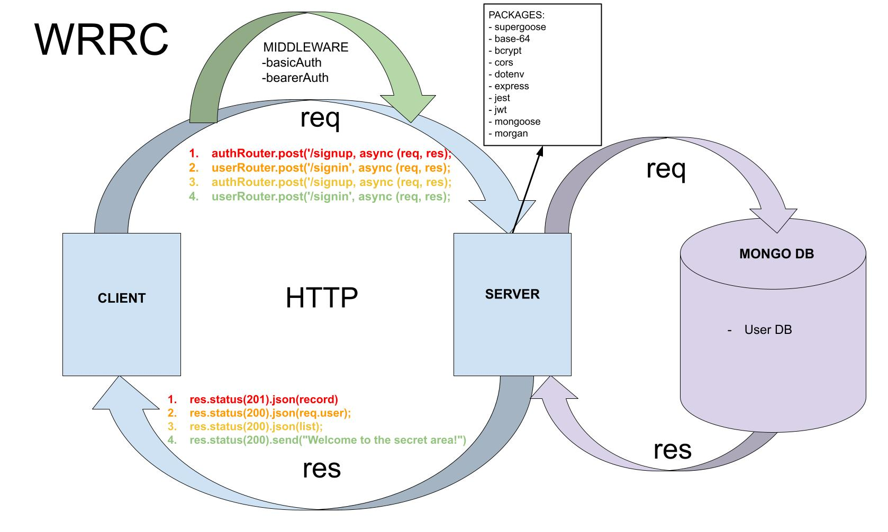

# Lab 08 - 401 JavaScript

# Auth Api

## Author: Mohammad Altamimi

### Links and Resources

✨ [Deployed Heroku Site](https://auth-api-mohammad.herokuapp.com/)

✨ [GitHub Actions](https://github.com/MohammadAltamimi98/auth-api/actions)

✨ [Pull Request](https://github.com/MohammadAltamimi98/auth-api/pull/1)
<br/>
<br/>

### Setup

- Clone down to your device
- In the root directory, run `npm install` to install node modules
- Run `nodemon` to see your live server via local host in your browser.

<br/>
<br/>

### Use

- You can create a new account via the /signup route, then sign into the route with the /signin route. Use [swagger.io](https://inspector.swagger.io/builder). 

```JS
{ "username": "TEST", "password": "TEST" }
```
<br/>
<br/>

### Test

In the command line at the root directory, `run npm test` to make sure all test are passing as expected.

<br/>

### UML / WRRC


